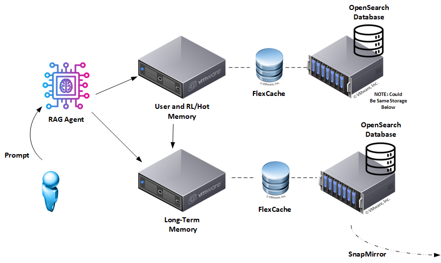

# Document RAG: Enterprise Version

Retrieval-Augmented Generation (RAG) has become a critical pattern for grounding Large Language Model (LLM) responses in real-world data, improving both accuracy and reliability. Yet, conventional RAG implementations often default to vector databases, which come with drawbacks: hallucinations, opaque ranking logic, and challenges with regulatory compliance.

In contrast, Document-centric RAG built on **lexical search (BM25)** offers a transparent and deterministic alternative. This mirrors capabilities produced by [Graph-based RAG and Knowledge Graphs](https://neo4j.com/blog/genai/what-is-graphrag/) but using BM25 search as the focal point. By prioritizing explicit term matching and leveraging an **external NER service** to extract normalized entities that are stored alongside documents, this architecture produces retrievals that are observable, reproducible, and audit-ready. Every query can be explained down to which entity or phrase matched and why a document was returned.

## Key Benefits of Document-based RAG

* **Transparency and Explainability**: BM25 matches are traceable through explicit queries, field names, and highlights... no hidden embedding-only ranking.
* **Semantic Coverage without Drift**: Vector context augments lexical grounding, expanding coverage while keeping factual anchors intact.
* **Determinism and Auditability**: Deterministic analyzers and explicit keyword fields ensure reproducible relevance decisions in the lexical layer.
* **Governance and Compliance**: Observable retrieval paths and stable provenance metadata simplify regulatory adherence and policy enforcement.
* **Bias and Risk Mitigation**: Domain-tuned entity extraction and curated vector indexing make signal selection explicit and reviewable.

## Dual-Memory Architecture

The enterprise Hybrid RAG agent uses a **HOT (unstable) + Long-Term store** design. To meet enterprise SLAs, we map these logical tiers to specific NetApp storage capabilities that guarantee isolation and performance:

| Memory Type | Infrastructure | NetApp Augmentation | Data Stored | Purpose |
| --- | --- | --- | --- | --- |
| **Long-term Memory** | Persistent OpenSearch index | **MetroCluster** (HA)  **FabricPool** (Tiering)  **SnapLock** (WORM) | Curated, validated documents with BM25 + vector fields | Authoritative knowledge base; compliance-ready |
| **HOT (unstable)** | High-performance OpenSearch node | **FlexCache**  **Storage QoS**  **FlexClone** | User-specific, unvetted facts and short-lived uploads | Governance boundary, per-user isolation, retention variations |

## Business Impact

Deploying Document-based RAG in the enterprise yields clear strategic advantages:

* **Operational clarity** via parallel LT+HOT queries and deterministic BM25 scoring with entity-level filters; storage tiers exist primarily for governance and isolation, not latency wins per se.
* **Improved compliance and risk control** thanks to explainable retrieval logic and complete data lineage.
* **Scalability and resilience** via leveraging enterprise storage practices.

By grounding AI systems in observable document retrieval instead of opaque embeddings, enterprises can increase trustworthiness, compliance, and operational clarity while meeting real-world performance requirements without relying on black-box ranking alone.

This guide provides an enterprise-oriented reference for implementing Document-based RAG architectures, enabling organizations to build faster, clearer, and fully governable AI solutions.

# 2. Ingesting Your Data Into Long-Term Memory

> **Same core pipeline, enterprise-grade surroundings.**
> This section mirrors the community version but emphasizes enterprise priorities such as audit trails, schema governance, and storage economics.

## Why We Start with Clean Knowledge

Long-term memory is the system's **source of truth**. Anything that lands here must be:

1. **Authoritative**: derived from validated, trusted documents.
2. **Traceable**: every document is stored with explicit provenance and metadata.
3. **Governance-ready**: aligned with organizational taxonomies, compliance policies, and audit requirements.

## Four-Step Ingestion Pipeline

| Stage | What Happens | Enterprise Add-Ons |
| --- | --- | --- |
| **1. Parse** | Raw content (text files, PDFs, tickets) is loaded into the pipeline. | **NetApp XCP** accelerates migration of massive legacy datasets (Hadoop/HDFS, NFS) into the ingest path. |
| **2. Slice** | Documents are ingested **as full docs** and additionally **chunked by paragraph by default**. | Preserve offsets and category metadata if you later enable alternative slicing strategies. |
| **3. Extract Terms** | An **external NER HTTP service** returns normalized entities (lowercased, deduped). | Maintain the NER service version separately; terms are stored, not the model name. |
| **4. Embed + Persist** | Each chunk is stored with **BM25 fields and vector embeddings** in OpenSearch. | Use **FlexClone** to fork the production index instantly for testing new embeddings without storage penalty. |

The ingestion process ensures idempotency at the document level via a stable identifier derived from the source path or URI. In enterprise settings, you can add a **batch ID** around each run to trace or roll back entire ingests.

### Implementation Considerations

* **Fast Migration with XCP:** If your source data lives in legacy HDFS or disparate NFS silos, use **NetApp XCP** to consolidate it into the RAG ingest path. XCP offers high-throughput copy and verification, ensuring that the "Source of Truth" in your RAG matches the source systems bit-for-bit.
* The reference pipeline **calls an external NER service** and performs **NER-only enrichment** during ingest. If you need fail-soft behavior, capture NER errors and store empty term lists without halting the run.
* **Safe Schema Upgrades with FlexClone:** When you need to update analyzers or test a new embedding model, do not reindex production blindly. Use **NetApp FlexClone** to create an instant, writable copy of your Long-Term index volume. Run your tests against the clone. It consumes no extra space until you write changes, and it keeps production 100% isolated.
* Provenance metadata is explicit and minimal: `filepath`/`URI`, `ingested_at_ms`, and `doc_version`. Track NER and embedding model versions at the service level for audit and reproducibility.
* **HOT → LT promotion policy:** the only time data moves from HOT back into LT is when there's (1) enough positive reinforcement to warrant promotion **or** (2) a trusted human-in-the-loop has verified the data.

## Additional Notes

* *Version everything.* Use the numeric `doc_version` and your VCS/infra configs to record mapping and analyzer changes you might reindex later.

With clean, well-labeled documents in long-term memory, every downstream RAG query inherits stable, auditable provenance. Next, we'll cover how to maintain **HOT (unstable)** as a user-specific tier for governance boundaries, TTL-based lifecycle, and operational isolation.

# 4. Promotion of Long-Term Memory into **HOT (unstable)**

> **Goal:** Maintain a governed, low-retention variations working set near the application while preserving provenance and compliance. This tiering exists primarily for **governance, isolation, and policy asymmetry** not because query latency on LT is inherently slow.

## Why Promote?

* **Retention variations control.** HOT absorbs high write rates, user uploads, and unstable facts without impacting LT's mappings, heap, or latency characteristics.
* **Policy asymmetry.** LT stays conservative (strict analyzers, WORM-like behavior); HOT can use permissive schemas, faster refresh, TTL/rollover, and relaxed matching for user-specific content.
* **Operational locality.** Keep user-specific context colocated with serving paths and GPUs while **leaving LT untouched**; throughput improves by isolating churn, not by per-request copying.

## Enterprise Twist vs. Community Guide

| Stage | Community Edition | Enterprise Edition |
| --- | --- | --- |
| **Detect entities** | Extract keywords/NER in the app process | **External NER HTTP service** produces normalized entities (lowercased, de-duplicated). |
| **Fetch docs** | Direct BM25 search on long-term index | **Filter by normalized entities** plus optional time window; align with lexical + vector eligibility |
| **Transfer data** | Script copies docs into cache index | HOT **pulls** or ingests only user-relevant docs with a filtered workflow |
| **TTL management** | Simple cron delete | **Eviction job** removes docs past TTL with rate limiting and capped batches |
| **Performance** | Standard shared resources | **Storage QoS** guarantees HOT tier latency (IOPS/Throughput) is never starved by background ingest. |

## Promotion Flow (Enterprise)

1. **User-specific context is selected out-of-band** from uploads, per-user ingest, or operator input using the external NER service.
2. **Promotion filter** targets normalized terms and optional time windows on `ingested_at_ms` when pulling shared docs into a user scope.
3. **HOT ingest or reindex workflow** pulls matching docs and stamps `hot_promoted_at` for lifecycle control.
4. **Serving**: the application **queries LT and HOT in parallel** and merges **BM25 grounding + vector context** before presenting context to the LLM.
5. **Eviction job** removes docs whose `hot_promoted_at` exceeds the configured TTL.

> **Reverse path (HOT → LT):** Promotion **only** occurs when (1) sufficient positive reinforcement warrants it **or** (2) a trusted human-in-the-loop verifies the data.

## Operational Knobs

| Variable | Typical Value | Purpose |
| --- | --- | --- |
| `TTL_MINUTES` | `30` | Eviction threshold for `hot_promoted_at`. |
| `DEST_INDEX` | `bbc` | Target HOT index/alias that receives promoted docs. |
| `REINDEX_REQUESTS_PER_SECOND` | `-1` (unlimited) | Rate limit for the promotion reindex task. |
| `PROMOTE_WINDOW_SECONDS` | `0` (disabled) | Only promote docs with recent `ingested_at_ms` if > 0. |

### Replication: the Enterprise Upgrade Path

Default is **on-demand reindex with explicit filters**. If you need continuous movement at scale:

1. **CCR (Cross-Cluster Replication)** can mirror indices; use filters or separate pipelines to limit scope.
2. **ISM policies** enforce lifecycle/retention alongside (or in place of) the eviction script.
3. **Event-driven promotions** (e.g., Kafka CDC) can trigger filtered reindexing when upstream systems change.

### Where to Run **HOT**

Your choice of backing store governs speed and operational flexibility:

| Option | Speed | Caveats | Best for |
| --- | --- | --- | --- |
| **In-memory index** | 🚀 Fastest, all docs in RAM | Limited by host memory; volatile on restart. | Demos, PoCs |
| **Local NVMe SSD** | ⚡ Near-memory once warmed | Data tied to node; rescheduling or failover harder. | Bare-metal, fixed clusters |
| **ONTAP FlexCache volume** | ⚡ Micro-second reads at scale | Requires NetApp ONTAP; gains portability and rescheduling flexibility. | Production Kubernetes or multi-site setups |

**Why FlexCache Helps Enterprises**

* **Elastic capacity** beyond physical RAM without pipeline redesigns.
* **Portability** cache volumes can follow pods across nodes/AZs.
* **Governance** SnapMirror and thin provisioning aid audit and cost control.

In short: **filtered reindex + TTL eviction** gives speed-through-isolation and determinism today; adding **CCR + ISM + FlexCache** layers in **resilience and governance** when scale and ops require it.

## 4. Implementation Guide

For a reference, please check out the following: [enterprise_version/README.md](./enterprise_version/README.md)

# 5. Conclusion

Document-based RAG turns retrieval-augmented generation from a black-box trick into a transparent, governed architecture. By grounding retrieval in explicit lexical search (BM25) and observable NER-derived terms (materializing the **working set** into **HOT (unstable)** when appropriate) you get answers that are:

* **Governed performance.** Parallel queries to LT and HOT keep UX consistent; tiers exist primarily for governance, isolation, and policy asymmetry. Any speedup is a secondary effect of locality and reduced churn.
* **Clearer.** Every match is traceable through explicit fields and analyzer settings in the lexical layer, with semantic context treated as augmentative rather than authoritative.
* **Safer.** Opaque embeddings are replaced with deterministic, explainable retrieval logic; hallucinations and hidden bias are easier to detect and fix.
* **Compliant.** Built-in provenance metadata (`filepath`/`URI`, `ingested_at_ms`, `doc_version`) makes regulatory alignment and retention policies straightforward.

The enterprise path centers on **user-specific HOT ingest and on-demand reindexing** executed with a remote source pointing to LT, filtered by normalized entities, plus a **TTL eviction job** keyed on `hot_promoted_at`. Query serving does **not** trigger reindex; the orchestrator searches LT and HOT in parallel, merges **BM25 grounding with vector context**, and supplies the combined evidence to the LLM. **HOT → LT promotion occurs only** when (1) sufficient positive reinforcement warrants it **or** (2) a trusted human-in-the-loop has verified the data.

## NetApp Enterprise Enhancements: The Resilience Layer

While the logic layer handles RAG, NetApp technologies solidify the physical data layer into an enterprise-grade platform. We avoid generic "tiering" in favor of RAG-specific storage policies:

* **High Availability with Zero RPO**: For the authoritative Long-Term memory, use **NetApp MetroCluster**. This ensures that even if a physical site fails, your RAG Knowledge Base remains online with zero data loss, maintaining business continuity for critical AI agents.
* **Noisy Neighbor Isolation via QoS**: RAG workloads are bursty. Ingest jobs can saturate disk I/O, starving the user-facing HOT tier. Use **NetApp Storage QoS** (Quality of Service) to set a minimum throughput floor for the HOT tier and a ceiling for background ingest tasks, guaranteeing predictable inference latency.
* **Instant ML Ops with FlexClone**: Testing new embedding models usually requires copying massive indices. **NetApp FlexClone** allows you to fork your Long-Term index instantly (zero-copy) for A/B testing new vector strategies without impacting production storage or performance.
* **Compliance Snapshots**: Use **SnapCenter** to take immutable, application-consistent snapshots of your vector indices. This allows you to "time travel" and prove exactly what your AI knew at any specific point in the past, a requirement for regulatory audits.
* **Accelerated Ingest with XCP**: When populating Long-Term memory from legacy HDFS or vast NFS shares, **NetApp XCP** provides the high-performance data migration required to hydrate your RAG pipeline efficiently.

## Next Steps

1. **Clone the repo.** The reference code and docs live at `github.com/your-org/document-rag-guide`. Try it locally with Docker Compose.
2. **Swap in your search backend.** All queries use standard OpenSearch DSL; adapt for Elasticsearch or your preferred lexical engine as needed.
3. **Feed it live data.** Point the ingest pipeline at a corpus (news feeds, Jira exports, PDFs) and run the NER service; **materialize HOT via filtered reindex out-of-band** (not in the request path).
4. **Tune the thresholds.** Adjust `α` (relative scoring cutoff), `TTL_MINUTES` (eviction window), `REINDEX_REQUESTS_PER_SECOND`, and optional `PROMOTE_WINDOW_SECONDS` until behavior matches your domain.
5. **Share lessons.** File issues, submit pull requests, or post a case study. This guide improves with community input and enterprise feedback.

Document-based RAG isn't a prototype... it's running code with governance baked in. Bring it into your stack and start building AI you can trust.
