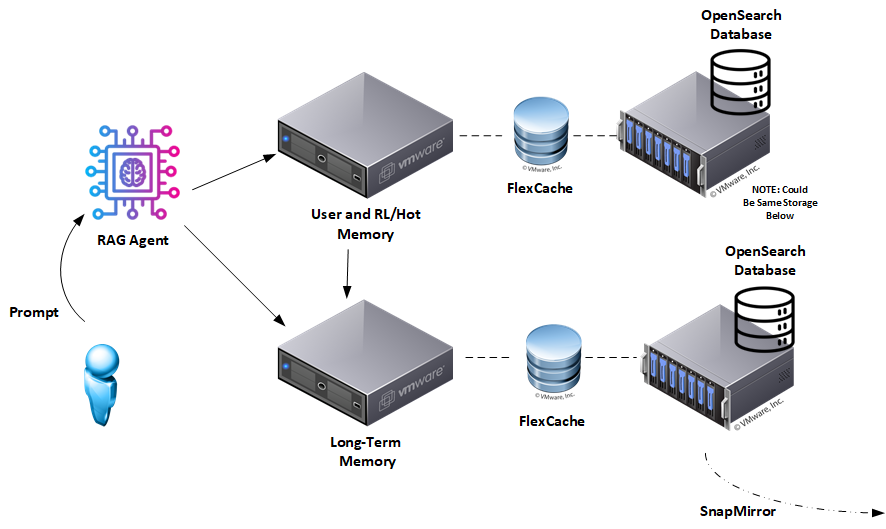

# Document RAG: Enterprise Version

Retrieval-Augmented Generation (RAG) has become a critical pattern for grounding Large Language Model (LLM) responses in real-world data, improving both accuracy and reliability. Yet, conventional RAG implementations often default to vector databases, which come with drawbacks: hallucinations, opaque ranking logic, and challenges with regulatory compliance.



In contrast, Document-centric RAG built on **lexical search (BM25)** offers a transparent and deterministic alternative. By prioritizing explicit term matching and leveraging external Named Entity Recognition (NER) for indexing, this architecture produces retrievals that are observable, reproducible, and audit-ready. Every query can be explained—down to which entity or phrase matched and why a document was returned.

## Key Benefits of Document-based RAG

- **Transparency and Explainability**: Each match is traceable through explicit queries, field names, and highlights—no hidden embedding math.
- **Determinism and Auditability**: Fixed analyzers, BM25 parameters, and explicit term fields ensure reproducible relevance decisions.
- **Governance and Compliance**: Observable retrieval paths simplify regulatory adherence and policy enforcement.
- **Bias and Risk Mitigation**: External NER models can be tailored to the domain, making keyword selection explicit and reviewable.

## Dual-Memory Architecture

The enterprise Document RAG agent uses a **short-term cache + long-term store** design:

| Memory Type          | Infrastructure                   | Data Stored                        | Purpose                                               |
| -------------------- | -------------------------------- | ---------------------------------- | ----------------------------------------------------- |
| **Long-term Memory** | Persistent OpenSearch index      | Curated, validated documents       | Authoritative knowledge base; compliance-ready        |
| **Short-term Cache** | High-performance OpenSearch node | Frequently accessed or recent docs | Rapid response for ongoing interactions               |

Promotion from short-term to long-term memory is handled via near-real-time replication (e.g., OpenSearch cross-cluster replication) or policy-driven pipelines, ensuring that validated insights flow into durable storage without compromising governance.

## Business Impact

Deploying Document-first RAG in the enterprise yields clear strategic advantages:

- **Operational efficiency** through low-latency cache queries and deterministic scoring.  
- **Improved compliance and risk control** thanks to explainable retrieval logic and complete data lineage.  
- **Scalability and resilience**, leveraging native OpenSearch replication, index state management, and enterprise storage solutions.  

By grounding AI systems in observable document retrieval instead of opaque embeddings, enterprises can significantly increase trustworthiness, compliance, and operational clarity—while still maintaining the performance required for real-world deployments.

This guide provides an enterprise-oriented reference for implementing Document-based RAG architectures, enabling organizations to build faster, clearer, and fully governable AI solutions.

Here’s the rewritten **Document RAG – Ingesting Your Data Into Long-Term Memory** section, aligned with the ingestion and governance principles we’ve been shaping in this thread.

# 2. Ingesting Your Data Into Long-Term Memory

> **Same core pipeline, enterprise-grade surroundings.**  
> This section mirrors the community version but emphasizes enterprise priorities such as audit trails, schema governance, and storage economics.

## Why We Start with Clean Knowledge

Long-term memory is the system's **source of truth**. Anything that lands here must be:

1. **Authoritative** – derived from validated, trusted documents.  
2. **Traceable** – every document is stored with explicit provenance and metadata.  
3. **Governance-ready** – aligned with organizational taxonomies, compliance policies, and audit requirements.

## Four-Step Ingestion Pipeline

| Stage              | What Happens                                                    | Enterprise Add-Ons                                                                 |
| ------------------ | --------------------------------------------------------------- | ---------------------------------------------------------------------------------- |
| **1. Parse**       | Raw content (text files, PDFs, tickets) is loaded into the pipeline. | Compute content hashes for tamper detection and store file paths for lineage.      |
| **2. Slice**       | Documents are ingested in full or split into sections, depending on retrieval needs. | Preserve offsets and category metadata for reconstruction and order integrity.      |
| **3. Extract Terms** | A Named Entity Recognition (NER) model tags key terms (people, orgs, products). | Each extracted term is version-stamped with the NER model used for auditability.    |
| **4. Persist**     | Documents are indexed into OpenSearch with explicit term fields. | Each record carries `filepath`, `ingestedAt`, and `schemaVersion` for observability. |

## Reference Code Snapshot *(adapted from community edition)*

```python
# ingest_bbc.py - trimmed
doc = {
    "content": text,
    "category": category,
    "filepath": str(p.as_posix()),
    "explicit_terms": explicit_terms,               # exact keyword field
    "explicit_terms_text": " ".join(explicit_terms),# BM25 scoring field
    "ner_status": "ok" if nlp else "skipped",
    "ner_model": NER_MODEL_NAME,
    "schemaVersion": "v1.0.0"
}
client.index(index=index_name, body=doc, refresh=False)
```

The ingestion script ensures idempotency at the document level. In enterprise settings, wrap each run in a **batch ID** so you can trace or roll back entire ingests if needed.

## Operational Knobs You Control

| Variable         | Typical Value          | Why You Might Change It                               |
| ---------------- | ---------------------- | ----------------------------------------------------- |
| `DATA_DIR`       | `/mnt/ingest`          | Point to NFS, S3-mount, or SharePoint sync.           |
| `NER_TYPES`      | `PERSON, ORG, PRODUCT` | Narrow scope to reduce noise and improve determinism. |
| `BATCH_SIZE`     | `500 docs`             | Tune for disk and network throughput.                 |
| `SCHEMA_VERSION` | `v1.0.0`               | Increment when analyzers, fields, or ontology shift.  |

### Implementation Considerations

* The reference pipeline uses **spaCy** for NER as a placeholder. In practice, it’s better to adopt or train a **domain-specific model** so extracted terms align with the entities your governance process actually cares about.
* All analyzers and BM25 parameters should be pinned and version-controlled. Changing them without reindexing risks non-deterministic behavior.
* Provenance metadata (file path, ingest time, schema version, NER model) is not optional—this is what turns search results into **audit-ready evidence**.

## Additional Notes

* *Keep the NER model lightweight for ingestion.* Heavy transformers slow batch jobs; reserve them for query-time enrichment.
* *Version everything.* Changes to analyzers, schema, or entity scopes are inevitable—stamp `schemaVersion` today to future-proof migrations.

With clean, well-labeled documents in long-term memory, every downstream RAG query inherits stable, auditable provenance. Next, we’ll see how to promote hot documents into a short-term cache for lightning-fast responses.

# 3. Promotion of Long-Term Memory into Short-Term Cache

> **Goal:** Keep the active conversation’s working set close to the LLM—low-latency like RAM, without losing provenance or compliance.

## Why Promote?

- **Latency kills UX.** Hitting the full long-term OpenSearch index on every query can add seconds of overhead. A smaller cache index keeps response times tight.  
- **Conversations are sticky.** Users tend to stay on a subject; caching those docs nearby avoids re-scanning the full corpus.  
- **Throughput matters.** Feeding GPUs or serving concurrent queries works best when the hot set is already cached in a high-speed store.  

## Enterprise Twist vs. Community Guide

| Stage               | Community Edition                               | Enterprise Edition                                                                  |
| ------------------- | ----------------------------------------------- | ---------------------------------------------------------------------------------- |
| **Detect entities** | Extract keywords/NER in the app process          | same                                                                                |
| **Fetch docs**      | Direct BM25 search on long-term index            | Identical BM25 query, but wrapped in a *replication/promotion pipeline*             |
| **Transfer data**   | Python script copies docs into cache index       | OpenSearch **Cross-Cluster Replication (CCR)** or scheduled reindex task with TTL   |
| **TTL management**  | Simple cron job deletes expired cache docs       | ISM (Index State Management) policies handle TTL, plus FlexCache auto-eviction      |

## Promotion Flow (Enterprise)

1. **Question arrives** — external NER extracts candidate entities.  
2. **Promotion query** runs against long-term OpenSearch using `terms_set` + BM25 fallback.  
3. **Replication or reindex job** copies matching docs into the short-term cache index, stamping each with `ttlExpiresAt`.  
4. **LLM retrieves** context from the cache index; latency drops to sub-100 ms.  
5. **ISM sweeper policy** automatically deletes expired docs once TTL has passed.  

```json
// Example promotion doc snippet
{
  "filepath": "/mnt/ingest/bbc/politics/file123.txt",
  "category": "politics",
  "content": "…",
  "explicit_terms": ["ernie wise","vodafone"],
  "promotionBatch": "batch-2025-09-22T12:00Z",
  "ttlExpiresAt": "2025-09-22T13:00:00Z"
}
```

## Operational Knobs

| Variable        | Typical Value     | Purpose                                          |
| --------------- | ----------------- | ------------------------------------------------ |
| `TTL_MS`        | `3_600_000` (1 h) | How long promoted docs live in cache.            |
| `CACHE_INDEX`   | `bbc_cache`       | Separate index for short-term cache.             |
| `BATCH_ID`      | `uuid` per run    | Trace or roll back specific promotions.          |
| `CCR_FREQUENCY` | `every 5 min`     | How often CCR/reindex checks for new promotions. |

### Replication: the Enterprise Upgrade Path

The community version simply re-indexes selected docs from Python. Enterprises need stronger guarantees:

1. **CCR (Cross-Cluster Replication)** can replicate entire indices or subsets from long-term to cache in near-real-time.
2. **ISM policies** enforce TTL at the cache layer, evicting expired docs automatically.
3. **Optional Kafka CDC** can be introduced later to drive promotions from events instead of queries.

> **CCR snippet (follower index mapping)**

```json
PUT /bbc_cache/_ccr/follow?leader_cluster=longterm&leader_index=bbc
```

Add a post-replication job to append TTL fields before serving.

### Where to Run the Cache

The backing store you pick for the cache determines both speed and ops flexibility:

| Option                     | Speed                         | Caveats                                                                | Best for                                   |
| -------------------------- | ----------------------------- | ---------------------------------------------------------------------- | ------------------------------------------ |
| **In-memory index**        | 🚀 Fastest, all docs in RAM   | Limited by host memory; volatile on restart.                           | Demos, PoCs                                |
| **Local NVMe SSD**         | ⚡ Near-memory once warmed     | Data tied to node; rescheduling or failover harder.                    | Bare-metal, fixed clusters                 |
| **ONTAP FlexCache volume** | ⚡ Micro-second reads at scale | Requires NetApp ONTAP; gains portability and rescheduling flexibility. | Production Kubernetes or multi-site setups |

**Why FlexCache Wins for Enterprises**

* **Elastic capacity** – Cache beyond physical RAM without redesigning pipelines.
* **Portability** – Cache volume can follow pods across nodes or AZs.
* **Governance** – SnapMirror replication and thin provisioning simplify audit and cost control.

In short: scripts and cron jobs get you speed, but pairing **OpenSearch CCR + ISM + FlexCache** delivers the **speed + resilience + governance** enterprises expect.

# 4. Reinforcement Learning and Data Promotion

> **Goal:** Let the cache teach long-term storage which documents deserve permanence—no cron jobs, no manual curation.

## Why a Feedback Loop?

- **Fresh context ages fast.** News articles, tickets, and feeds land in short-term cache minutes after ingestion. Most expire quietly; a few become permanent knowledge.  
- **Humans validate, models reuse.** Each time a cached document answers a question—or a subject-matter expert explicitly approves it—its confidence score increases.  
- **Promote only the proven.** Once a document’s score crosses a threshold, it graduates into long-term storage automatically.  

## Enterprise Twist vs. Community Guide

| Stage                | Community Edition (`promote.py`)               | Enterprise Edition (CCR / CDC)                                                |
| -------------------- | ---------------------------------------------- | ----------------------------------------------------------------------------- |
| **Score hits**       | Counter tracked in the app layer               | Same; persisted into OpenSearch `_source`                                     |
| **Cross threshold**  | Python script re-indexes doc into long-term    | Add `validated=true`; promotion handled via OpenSearch CCR or Kafka CDC        |
| **Remove expiration**| Script clears `ttlExpiresAt`                   | ISM policy or sink job strips `ttlExpiresAt` at merge into long-term          |
| **Audit trail**      | Print to stdout                                | Log to Kafka topic or append to OpenSearch audit index                        |

## Promotion Workflow (Enterprise)

1. **New doc arrives** — ingested into short-term cache with `confidence_score = 1` and `ttlExpiresAt = now() + TTL_MS`.  
2. **Cache hit or SME validation** — a trigger increments `confidence_score` (e.g., `+1` per retrieval, `+10` per manual confirm).  
3. **Threshold reached** — when `confidence_score ≥ PROMOTE_THRESHOLD`, the app marks the doc with `validated=true`.  
4. **Replication event** — either via CCR, reindex, or Kafka CDC, the validated doc is copied into long-term storage.  
5. **TTL removal** — the long-term copy drops `ttlExpiresAt` and records `promoted=true`.  
6. **Confirmation log** — each promotion is written to an audit index or Kafka topic with timestamps and batch IDs.  

```json
// Example: increment score on cache hit
POST /bbc_cache/_update/123
{
  "script": {
    "source": "ctx._source.confidence_score = (ctx._source.confidence_score ?: 0) + params.weight",
    "params": { "weight": 1 }
  }
}
```

## Operational Knobs

| Variable            | Default     | Purpose                                       |
| ------------------- | ----------- | --------------------------------------------- |
| `HIT_WEIGHT`        | `1`         | Increment per automatic reuse in answers      |
| `VALIDATION_WEIGHT` | `10`        | Increment per explicit SME approval           |
| `PROMOTE_THRESHOLD` | `25`        | Score required for long-term promotion        |
| `TTL_MS`            | `3_600_000` | Prevents unproven docs from lingering forever |

### Example: Promotion Reindex Request

```json
POST _reindex
{
  "source": { "index": "bbc_cache", "query": { "term": { "validated": true } } },
  "dest":   { "index": "bbc_longterm" },
  "script": {
    "source": """
      ctx._source.remove("ttlExpiresAt");
      ctx._source.promoted = true;
      ctx._source.promotionBatch = params.batchId;
    """,
    "params": { "batchId": "2025-09-22T12:00Z" }
  }
}
```

*Note:* Clearing `ttlExpiresAt` during promotion is the signal that a document has graduated to long-term storage.

## Governance & Safety Wins

* **Traceable promotions** — every promotion event includes batch ID, timestamp, and source index; auditors can replay the exact path.
* **Bias visibility** — because each promotion records `sourceFeed` or `filepath`, analysts can see if one content stream dominates long-term memory.
* **Instant rollback** — demote a document by unsetting `promoted`, re-emitting a tombstone event, and letting the sink job remove it from long-term while leaving the cache intact.

Short-term memory now acts as an always-on incubator: strong signals push documents up, weak ones fade out, and governance stays on autopilot. Next, we’ll wrap the paper with a concise Conclusion and call to action.

## 5. Implementation Guide

For a reference, please check out the following: [enterprise_version/README.md](./enterprise_version/README.md)

Here’s the **conclusion rewritten for Document RAG**, aligned with the governance-first, OpenSearch-based design we’ve been building.

# 6. Conclusion

Document-based RAG turns retrieval-augmented generation from a black-box trick into a transparent, governed architecture. By grounding retrieval in explicit lexical search (BM25) and observable NER-derived terms—and keeping hot data in a short-term cache—you get answers that are:

- **Faster.** Cached queries hit sub-100 ms latency, keeping UX smooth and accelerators fully utilized.  
- **Clearer.** Every match is traceable through explicit fields, analyzer settings, and `matched_queries`. Auditors can replay the exact path to a result.  
- **Safer.** Opaque embeddings are replaced with deterministic, explainable retrieval logic; hallucinations and hidden bias are easier to detect and fix.  
- **Compliant.** Built-in provenance metadata (`filepath`, `ingestedAt`, `schemaVersion`) makes regulatory alignment and retention policies straightforward.  

The enterprise extensions—Cross-Cluster Replication (CCR), Index State Management (ISM) TTL policies, and NetApp FlexCache for high-speed caching—provide the operational muscle needed for 24/7 workloads and multi-site resilience.

## Next Steps

1. **Clone the repo.** The reference code and docs live at `github.com/your-org/document-rag-guide`. Try it locally with Docker Compose.  
2. **Swap in your search backend.** All queries use standard OpenSearch DSL; adapt for Elasticsearch or your preferred lexical engine as needed.  
3. **Feed it live data.** Point the ingest pipeline at a corpus—news feeds, Jira exports, or PDFs—and watch the short-term cache populate.  
4. **Tune the thresholds.** Adjust `α` (relative scoring threshold), `HIT_WEIGHT`, and `PROMOTE_THRESHOLD` until promotions reflect your domain’s truth bar.  
5. **Share lessons.** File issues, submit pull requests, or post a case study. This guide improves with community input and enterprise feedback.  

Document-based RAG isn’t a prototype—it’s running code with governance baked in. Bring it into your stack and start building AI you can trust.  
