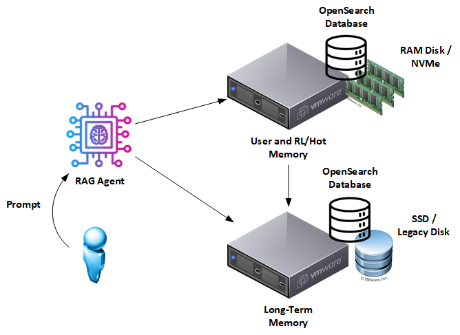

# Document RAG: Open Source Community Version

Most “RAG” stacks start with vectors and end with questions from auditors: *why did that snippet surface, which fields mattered, and can we reproduce the response tomorrow?* Document RAG flips the playbook. We begin with **OpenSearch BM25** and **Domain-specific NER** so retrieval is explicit, auditable, and grounded in text and metadata you control—then add dense signals only if they earn their keep.



**Why lexical-first beats black-box vectors**

* **Explainability on day one.** We treat entities and keywords as first-class citizens and query them directly. You can point to the exact fields and terms that fired—no hand-waving about “semantic neighbors.”
* **Deterministic, governable search.** Fixed analyzers, pinned BM25 params, named query branches, and highlights produce runs you can replay and defend in audits. This is governance-friendly by construction, not marketing.
* **Reduce hallucinations without hiding the ball.** Answers are grounded in retrieved documents (not vector vibes), and every claim traces back to source evidence.

**How this stack works**

A domain-trained NER pipeline enriches documents at ingest—people, products, regulations, SKUs, case IDs—then we index both the **raw text** and **explicit entity fields**. Retrieval runs **strict-then-fallback**: first require entity co-occurrence and exact phrases; if nothing qualifies, broaden to a full-question BM25 query. The result: fast, legible hits with **highlights** and **matched query branch names** so you can always answer *why* a doc matched.

**Dual-memory design (short vs. long) with OpenSearch**

| Layer                         | Where it lives                                | What it stores                               | Why it matters                                                        |
| ----------------------------- | --------------------------------------------- | -------------------------------------------- | --------------------------------------------------------------------- |
| **Long-term memory**          | Dedicated OpenSearch index on durable storage | Curated, vetted content + stable NER fields  | Authoritative source with provenance; ideal for compliance and audits |
| **Short-term memory / cache** | Separate OpenSearch index on faster media     | Fresh, session-scoped context and live feeds | Low-latency lookups; natural place to enforce TTLs and test new facts |

Promotion is metadata-driven: when a short-term fact graduates, it moves into long-term with provenance intact. Retention policies remain explicit (TTL in short-term; durable in long-term).

**Business impact**

* **Transparency & Accountability:** Each answer links to the exact excerpts used; query logic and evidence are loggable and reproducible.
* **Compliance by design:** Clear lifecycles (short-term TTL vs. long-term retention) simplify GDPR/HIPAA-style obligations.
* **Lower risk, higher signal:** Grounded retrieval reduces fabrication while keeping dense signals as an optional, declared add-on—not a hidden default.

The sections that follow show how to **ingest** with NER enrichments (stable mappings, fail-soft if NER is unavailable), **retrieve** with strict-then-fallback BM25 (`dis_max`, named branches, highlights), and **promote** knowledge between short- and long-term stores—all with observability hooks that make auditors smile. Welcome to document-based RAG: **explainable first, scalable always.**

## 2. Ingesting Your Data Into Long-Term Memory

### Why We Start With Deterministic Indexing

Long-term memory is the system’s **source of truth**. Every document that lands here must be clean, auditable, and ready for governance. That means explicit mappings, predictable analyzers, and transparent enrichments. The ingestion pipeline does four things in a single pass:

1. **Parses raw text** from articles, manuals, or tickets.
2. **Optionally slices into paragraphs** (tunable—sentence granularity if needed).
3. **Extracts named entities** with an external NER model (spaCy in reference code; domain-trained preferred).
4. **Persists text + entity fields** into OpenSearch with stable analyzers and case-normalized terms.

Do this well once, and every downstream RAG query inherits the same deterministic, audit-friendly provenance.

### Pipeline at a Glance

The reference `ingest_bbc.py` makes it concrete:

* Documents are read from disk, category metadata is attached, and text is stored in a `content` field.
* Entities are normalized (lower-cased, deduplicated) and indexed into both:

  * `explicit_terms` (keyword, case-insensitive)
  * `explicit_terms_text` (text, BM25-scored)

This dual representation allows both **exact AND queries** and **lexical BM25 recall** to be fully explainable.

```
Document {
   filepath
   category
   content
   explicit_terms        -> keyword, case-insensitive
   explicit_terms_text   -> text, BM25-enabled
   ner_status, ner_model -> audit trail
}
```

Each document is immutable once indexed, but can carry TTL metadata (for short-term caches) or provenance fields (for compliance).

### Step-by-Step Walkthrough

| Stage                       | What happens                                                          | Code cue              |
| --------------------------- | --------------------------------------------------------------------- | --------------------- |
| **1. Load a spaCy model**   | `nlp = spacy.load("en_core_web_sm")` or your domain-trained model.    | `load_spacy()`        |
| **2. Walk the dataset**     | For every `.txt` file, derive `category` from the folder.             | `glob("bbc/*/*.txt")` |
| **3. Read text**            | Raw file body stored under `content`.                                 | `p.read_text()`       |
| **4. Extract entities**     | NER loop filters labels via `INTERESTING_ENTITY_TYPES`.               | `extract_entities()`  |
| **5. Deduplicate entities** | Normalize to lowercase, avoid repeats.                                | `seen` set            |
| **6. Persist doc**          | Call `client.index()` with `explicit_terms` + `explicit_terms_text`.  | `client.index()`      |
| **7. Audit enrichments**    | `ner_status` and `ner_model` fields log whether enrichment succeeded. | doc fields            |
| **8. Refresh once**         | Refresh index after batch, not per doc.                               | `indices.refresh()`   |

### Operational Knobs You Control

| Environment variable                 | Purpose                                                     |
| ------------------------------------ | ----------------------------------------------------------- |
| `DATA_DIR`                           | Root directory of raw `.txt` files (organized by category). |
| `INDEX_NAME`                         | Name of the OpenSearch index to create/target.              |
| `NER_MODEL`                          | SpaCy model name or custom pipeline for entity extraction.  |
| `DEFAULT_TERMS`                      | Comma-separated list of terms to apply to all docs.         |
| `OPENSEARCH_HOST/PORT/USER/PASS/SSL` | Connection details for your OpenSearch cluster.             |

Because the script is pure client code, migrating between dev and prod clusters is a matter of updating these variables.

### Implementation Considerations

The provided NER step uses spaCy only for demonstration. For real governance use-cases, you’ll want to swap in a **domain-trained model** that extracts the entities and keywords most relevant to your compliance scope—product codes, regulation IDs, customer IDs, etc.

The important part isn’t which model you use, but that the pipeline **records** which model enriched the data (`ner_model` field) and whether enrichment succeeded (`ner_status`). That’s the transparency auditors demand.

Think of the ontology here as an **index schema** rather than a graph: explicit keyword fields, lexical text fields, and audit metadata. Together, they make your long-term memory both **searchable and defensible**.

## 3. Promotion of Long-Term Memory into Short-Term Cache

### Why bother with promotion?

Most conversations orbit a small set of entities and constraints—**today’s hot topics**. Promoting those topics’ **relevant paragraphs** into a **short-term OpenSearch index** (fast storage + TTL) keeps latency predictable, keeps BM25 warm, and avoids hammering the long-term store. The kicker: promotion is **metadata-only** and fully auditable.

### How the promotion cycle works

1. **Detect entities in the user’s question.**
   Run NER on the prompt to collect normalized entity strings (e.g., `["ernie wise", "vodafone"]`). We already use these for STRICT retrieval; the **new** step is to treat them as cache promotion candidates.

2. **Fetch the full context from long-term memory.**
   Use the **STRICT** query branch (AND over `explicit_terms` + `match_phrase` on `content`) to pull the paragraphs and filepaths that matter. This guarantees that what we cache is exactly what STRICT would have returned.

3. **Write into the short-term index with TTL.**
   Copy each hit’s minimal record—`filepath`, `category`, `content` fragment (or whole doc), `explicit_terms`, and an **expiration timestamp**. We do **not** modify the long-term document.

4. **Optionally include the whole document.**
   For answer styles that cite whole files, cache the entire `content`. Otherwise, cache only **highlighted fragments** + a pointer to the source file.

5. **Serve from cache first.**
   Retrieval checks the short-term index first (low latency). On a miss, it falls back to long-term, and **that miss can trigger promotion**.

### Code cues (Python, OpenSearch)

**Promotion (pull from long-term, push to short-term)**

```python
from datetime import datetime, timedelta, timezone
from opensearchpy import OpenSearch, helpers

LT_INDEX = "docs_long"
ST_INDEX = "docs_short"
TTL_MINUTES = int(os.getenv("TTL_MINUTES", "60"))

def promote_entities(client: OpenSearch, entities: list[str], include_full_doc: bool = False):
    # 1) Strict fetch from long-term
    strict_q = build_query(question=" ".join(entities), entities=entities)  # from retrieve.py
    res = client.search(index=LT_INDEX, body={"query": strict_q, "size": 100,
                                              "highlight":{"fields":{"content":{"fragment_size":180,"number_of_fragments":3}}},
                                              "_source":["filepath","category","content","explicit_terms","explicit_terms_text","ner_model","ner_status"]})
    if not res["hits"]["hits"]:
        return 0

    # 2) Prepare cache docs
    expire_at = (datetime.now(timezone.utc) + timedelta(minutes=TTL_MINUTES)).isoformat()
    actions = []
    seen = set()  # session-level de-dupe by (filepath, highlight)
    for h in res["hits"]["hits"]:
        src = h["_source"]
        snippets = h.get("highlight", {}).get("content", [])
        payloads = [src["content"]] if include_full_doc or not snippets else snippets
        for body in payloads:
            key = (src["filepath"], body[:128])  # crude but stable-ish cache key
            if key in seen: 
                continue
            seen.add(key)

            doc = {
                "filepath": src["filepath"],
                "category": src.get("category"),
                "content": body,
                "explicit_terms": src.get("explicit_terms", []),
                "explicit_terms_text": src.get("explicit_terms_text",""),
                "promotion_reason": {"entities": entities, "branch": "STRICT:all-entities"},
                "expire_at": expire_at,           # explicit TTL timestamp
                "source_index": LT_INDEX,
                "cached_at": datetime.now(timezone.utc).isoformat(),
            }
            # idempotent-ish: stable _id from filepath + body hash
            _id = f"{hash(src['filepath'])}-{hash(body)}"
            actions.append({"_op_type":"index","_index":ST_INDEX,"_id":_id,"_source":doc})

    # 3) Bulk write to short-term
    helpers.bulk(client, actions, request_timeout=120)
    client.indices.refresh(index=ST_INDEX)
    return len(actions)
```

**Serving from cache first (then long-term fallback)**

```python
def search_with_cache(client: OpenSearch, question: str, entities: list[str], alpha: float = 0.4, k: int = 5):
    q = build_query(question, entities)

    # First: short-term
    st = client.search(index=ST_INDEX, body={"query": q, "size": k,
                                             "highlight": {"fields":{"content":{"fragment_size":180,"number_of_fragments":3}}},
                                             "_source":["filepath","category","content","promotion_reason","expire_at"]})
    hits = st["hits"]["hits"]
    if hits:
        return hits  # already cached; low latency

    # Miss: long-term, then opportunistic promote
    lt = client.search(index=LT_INDEX, body={"query": q, "size": k,
                                             "highlight":{"fields":{"content":{"fragment_size":180,"number_of_fragments":3}}},
                                             "_source":["filepath","category","content","explicit_terms","explicit_terms_text"]})
    if lt["hits"]["hits"]:
        promote_entities(client, entities, include_full_doc=False)
    return lt["hits"]["hits"]
```

### Key design decisions

| Design choice                                  | Rationale                                                                                         |
| ---------------------------------------------- | ------------------------------------------------------------------------------------------------- |
| **TTL on the cached document, not the source** | The short-term record carries `expire_at`. Long-term remains immutable → perfect for audits.      |
| **STRICT-driven promotion**                    | We only cache content that already satisfies explainable, conjunctive constraints.                |
| **Idempotent bulk upserts**                    | Deterministic `_id` generation avoids duplicates on retries.                                      |
| **Storage-agnostic**                           | Short-term can live on NVMe, RAM disk, or a replicated volume; OpenSearch config stays identical. |

### Operational knobs you can tweak

| Env / setting              | What it controls                                                               |
| -------------------------- | ------------------------------------------------------------------------------ |
| `TTL_MINUTES`              | Lifetime of cached records (default 60).                                       |
| `include_full_doc` flag    | Cache snippet fragments (fast, small) vs. full documents (easier LLM prompts). |
| `ST_INDEX` / `LT_INDEX`    | Index names; keep mappings compatible for easy promotion.                      |
| `INTERESTING_ENTITY_TYPES` | Which NER labels trigger promotion (PERSON, ORG, etc.).                        |
| Backing storage            | NVMe, RAM disk, or a performance SSD pool.                                     |

### Tips from the field

* **Batch promotions.** Promote all new entities from a turn in one bulk call to avoid chatty per-entity round-trips.
* **Monitor cache hit rate.** If <70%, increase TTL or broaden which labels/constraints qualify for promotion.
* **Keep cache small.** Snippet-first caching + full-doc on demand is the sweet spot for latency and cost.

## 4. Reinforcement & Data Promotion (Short → Long)

### Why a feedback loop matters

Short-term memory is your **working set**; reinforcement decides what **graduates** to long-term. We watch how often a cached snippet is re-used, validated, or corrected. When its **confidence** clears a threshold, we **copy the authoritative source** (not the snippet) into long-term—or mark that the source doc is already authoritative.

### Signals and scoring (document-RAG style)

* **Cache hits:** Every time a cached snippet participates in an answer, increment its `confidence_score`.
* **Human validation (optional):** SME feedback boosts the score more than a passive hit.
* **Correction penalty:** Negative feedback decrements confidence.
* **Thresholded promotion:** When `confidence_score >= PROMOTE_THRESHOLD`, we record a **promotion event** and (a) extend or remove TTL in long-term, or (b) mark the document as **vetted**.

**Where to store scores?**
Keep per-snippet scores in the **short-term record** (easy to expire). The long-term copy remains clean; the **promotion log** captures *who/when/why*.

### Promotion workflow

| Stage                  | Trigger                                | Action                                                                                                  |
| ---------------------- | -------------------------------------- | ------------------------------------------------------------------------------------------------------- |
| **1. Cache write**     | Snippet copied into short-term         | Initialize `confidence_score=1`, set `expire_at`.                                                       |
| **2. Increment**       | Snippet used in an answer              | `confidence_score += HIT_WEIGHT`.                                                                       |
| **3. Validate**        | SME marks “correct”                    | `confidence_score += VALIDATION_WEIGHT`.                                                                |
| **4. Cross threshold** | `confidence_score ≥ PROMOTE_THRESHOLD` | Copy authoritative source fields to long-term (or mark `vetted:true`); remove TTL; write promotion log. |
| **5. Audit**           | After copy                             | Append record with timestamp, user/session, entities, and reason (“frequent hit”, “SME validated”).     |

### Code cues (Python)

**Increment confidence on use**

```python
def bump_confidence(client: OpenSearch, st_id: str, hit_weight: int = 1):
    client.update(index=ST_INDEX, id=st_id, body={"script":{
        "source":"ctx._source.confidence_score = (ctx._source.confidence_score ?: 0) + params.w",
        "lang":"painless","params":{"w":hit_weight}
    }})
```

**Promote when threshold is met**

```python
PROMOTE_THRESHOLD = int(os.getenv("PROMOTE_THRESHOLD","20"))

def maybe_promote(client: OpenSearch, st_id: str):
    doc = client.get(index=ST_INDEX, id=st_id)["_source"]
    if doc.get("confidence_score",0) < PROMOTE_THRESHOLD:
        return False
    # Copy authoritative source fields from long-term
    src = client.search(index=LT_INDEX, body={"query":{"term":{"filepath.keyword":doc["filepath"]}}, "size":1})
    if src["hits"]["hits"]:
        # Mark vetted; or upsert with vetted flag
        _id = src["hits"]["hits"][0]["_id"]
        client.update(index=LT_INDEX, id=_id, body={"doc":{"vetted":True, "vetted_at": datetime.now(timezone.utc).isoformat()}})
    # Write a promotion log (separate index)
    client.index(index="promotion_logs", body={
        "filepath": doc["filepath"], "reason":"confidence_threshold",
        "entities": doc.get("promotion_reason",{}).get("entities",[]),
        "score": doc.get("confidence_score",0),
        "ts": datetime.now(timezone.utc).isoformat()
    })
    return True
```

### Tunables you should expose

| Variable            | Default | Why you might change it                                                |
| ------------------- | ------- | ---------------------------------------------------------------------- |
| `HIT_WEIGHT`        | 1       | Increase for long chat sessions; decrease for high-volume API traffic. |
| `VALIDATION_WEIGHT` | 10      | Raise in SME-reviewed flows; lower in automated ones.                  |
| `PROMOTE_THRESHOLD` | 20      | Higher for regulated data; lower for internal knowledge.               |
| `TTL_MINUTES`       | 60      | Shorten for bursty news; extend for slower domains.                    |

### Governance & safety wins

* **Traceable updates.** Promotion logs show who/what/why a fact became **vetted**.
* **Bias checks.** Because promotion logs include entity lists and sources, you can audit which topics dominate.
* **Rollback-ready.** If a promoted item proves wrong, clear `vetted:true` and re-ingest with corrected provenance—long-term records stay immutable and explainable.

### Field notes

Start narrow: promote only STRICT-qualified snippets and watch the **cache hit rate**. Tune `TTL_MINUTES`, `HIT_WEIGHT`, and `PROMOTE_THRESHOLD` before changing retrieval logic. This keeps the system explainable and the audit trail pristine—**lexical first, always observable.**

## 5. Implementation Guide

For reference, see the document-RAG starter: [community\_version/README.md](./community_version/README.md)

**What you’ll wire up:**

* **OpenSearch indices**

  * `docs_long` — durable, audit-ready store with pinned analyzers and BM25 params
  * `docs_short` — high-speed cache with TTL and promotion metadata
* **Pipelines & scripts**

  * `create_index.py` — stable mappings (explicit analyzers/normalizers, fixed BM25)
  * `ingest_bbc.py` — deterministic ingest with optional NER enrichments (`explicit_terms`, `explicit_terms_text`, `ner_status`, `ner_model`)
  * `retrieve.py` — **STRICT-then-FALLBACK** query builder with named branches (`_name`) and highlights
  * `qa.py` — end-to-end retrieval + evidence block (top-1 vs α-filtered list)
  * `promotion.py` — opportunistic short-term caching + TTL (metadata-only; long-term untouched)
  * `promotion_job.py` — confidence-based reinforcement (cache hits, SME validation → mark long-term **vetted**)

**Determinism checklist (commit these to git):**

* Index settings (analyzers, normalizers, BM25 `k1/b`)
* Canonical query payloads and expected top-K outputs (scores + `matched_queries`)
* NER model identity (`ner_model`) and status (`ner_status`)
* Relevance policy: server boosts (STRICT/LENIENT/FALLBACK) and client threshold `α`

**Local run (happy path):**

```bash
# 1) Bring up OpenSearch (independent or 2-node cluster)
docker compose -f docker-compose.independent.yml up -d

# 2) Create deterministic index
python create_index.py

# 3) Ingest with fail-soft NER
python ingest_bbc.py

# 4) Query with STRICT-then-FALLBACK, return highlights + reasons
python qa.py

# 5) Turn on caching + reinforcement (optional)
python promotion.py
python promotion_job.py
```

## 6. Conclusion

Document-first RAG gives you more than quick answers—it gives you answers you can **defend**.

* **Transparency & explainability** are built-in: explicit fields, named query branches, and highlights show *exactly* why a document matched.
* **Accountability & risk control** improve because retrieval is deterministic (pinned analyzers/BM25) and every enrichment is logged.
* **Compliance** turns into an operational posture: immutable long-term store, TTL-driven short-term cache, and promotion logs that auditors can read.

Pair that with the dual-memory layout—**fast short-term cache** for today’s hot topics plus **durable long-term memory** for provenance—and you get a system that’s **responsive now** and **auditable later**.

### Your next steps

1. **Clone the repo and run the stack.** Stand up OpenSearch, create indices, ingest, and issue a few STRICT queries to see `matched_queries` and highlights in action.
2. **Swap the NER.** Replace spaCy small with your domain-trained model; keep `ner_model`/`ner_status` for traceability.
3. **Enable cache & reinforcement.** Turn on short-term promotion with TTL; log cache hits and SME validations to drive **vetted** status upstream.
4. **(Optional) Add vectors—explicitly.** If you introduce dense fields, declare the indexers, fields, and scoring mix (RRF or linear), and log branch scores alongside lexical branches.
5. **Share what you learn.** PRs with analyzer tweaks, relevance sweeps, and governance playbooks make the ecosystem better.

Document-based RAG isn’t a thought experiment; it’s running code with clear governance wins. Spin it up, measure it, and raise the bar for responsible retrieval.
