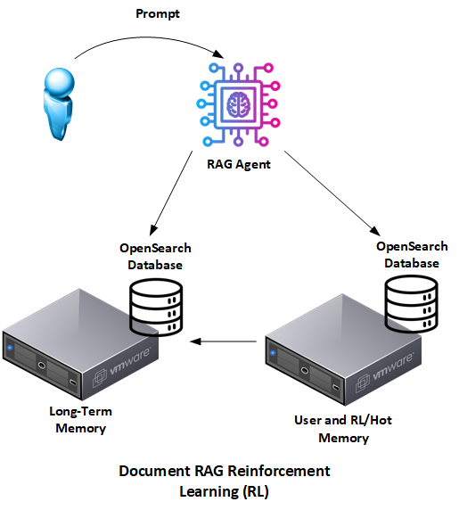

# Document-Based RAG: Better Option for AI Governance

Welcome to the **Document RAG Guide**: a dual-store (LT + HOT) OpenSearch approach to Retrieval-Augmented Generation that delivers answers that are **transparent, deterministic, and governance-ready** by design. The repo houses two fully working paths:

* **Community / Open-Source Version**: a self-contained demo you can run on a laptop or in a pure open-source deployment.
* **Enterprise Version**: a production-grade variant that layers in ingest pipelines, NetApp FlexCache, SnapMirror, and other operational muscle.



By storing knowledge as **documents with enriched metadata** (named entities and provenance tags) instead of opaque vectors alone, the agent gains traceability, reduces hallucinations, and meets demanding audit requirements.

### Project Purpose

This project was developed to address limitations of traditional vector-centric RAG and to make retrieval **explainable** and **auditable**.

* **Performance & latency**: Benchmarks show that splitting stores isn't about raw speed. The LT/HOT split exists primarily for **governance boundaries**, **retention variations control**, and **policy asymmetry**; retrieval remains lexical-first and observable.
* **Transparency and Explainability**: Vector embeddings are opaque. Document-based RAG stores explicit entity metadata (`explicit_terms`, `explicit_terms_text`) and uses fielded, auditable BM25 queries so you can show *why* a document matched.

Key objectives include:

* Provide a reference architecture for **Document-based RAG** with explicit **HOT (unstable)** and **Long-Term (LT)** tiers.
* Make promotion from **HOT → LT** a **controlled event** that happens only when (1) there is **enough positive reinforcement** of the data **or** (2) a **trusted human-in-the-loop** has verified it.
* Show upgrade paths-from a minimal Python demo to an enterprise pipeline with NetApp enterprise storage.

### What's inside this repo today

* A concrete example of **paragraph-level chunking** (`community_version/ingest.py`) that writes both full documents and deterministic paragraph slices (`bbc-chunks` by default) so retrieval can target semantically tight spans without guessing where a fact lives inside a file.
* An **external BM25 document ranker** (`community_version/common.py`) that re-scores combined hits from LT and HOT after the initial OpenSearch search. The same lexical query hits both stores in parallel, then the local BM25 stage ranks the merged set before the LLM sees any context, keeping the governance story explainable end-to-end.

## Benefits Over Vector-Based RAG

Adopting Document-based RAG addresses several key limitations of traditional RAG agents:

* **Multi-Step Reasoning**: OpenSearch indexing with entity enrichment supports complex, entity-aware queries across related documents.
* **Bias Mitigation**: Explicit metadata and annotations expose skew and make it easier to correct.
* **Improved Compliance and Governance**: Provenance fields and auditable clauses enable traceable, regulator-friendly retrieval.
* **Risk Management**: Deterministic lexical logic and highlights reduce hallucinations and make review straightforward.

### Community vs Enterprise: What Changes?

| Capability                 | Community Edition                             | Enterprise Edition                                                          |
| -------------------------- | --------------------------------------------- | --------------------------------------------------------------------------- |
| **HOT backing store**      | `tmpfs` / RAM-disk on the dev box             | **NetApp FlexCache** for locality; durability via **SnapMirror** replicas   |
| **Governance hooks**       | Basic provenance tags                         | Promotion events logged, schema-versioned, and instantly traceable          |
| **Latency posture**        | Latency is secondary to governance boundaries | Latency tuned per SLA, but the split is for **governance/policy asymmetry** |

> **TL;DR:** start with the community guide for laptops and commodity hardware; switch to the enterprise path when you need multi-site, 24×7, and **governance** at scale. The split exists for **control and auditability**, not because latency forces it.

## Where To Dive Deeper

| Document                                     | What it covers                                                                                        |
| -------------------------------------------- | ----------------------------------------------------------------------------------------------------- |
| **Document Search for Better AI Governance** | Vision & governance rationale for Document RAG [link](./Document_Search_for_Better_AI_Governance.md)  |
| **Community Version Guide**                  | Step-by-step setup for the open-source flavour [link](./OSS_Community_Version.md)                     |
| **Community README**                         | Hands-on commands & scripts [link](./community_version/README.md)                                     |
| **Enterprise Version Guide**                 | Deep dive on ingest pipelines, FlexCache, SnapMirror [link](./Enterprise_Version.md)                  |
| **Enterprise README**                        | Production deployment notes [link](./enterprise_version/README.md)                                    |

## Quick Start

```bash
# 1. Clone the repo
$ git clone https://github.com/davidvonthenen/document-rag-guide.git

# 2. Pick your path
$ cd document-rag-guide/community_version   # laptop demo
# or
$ cd document-rag-guide/enterprise_version  # prod-ready setup

# 3. Follow the README in that folder
```

Questions? Open an issue or start a discussion and contributions are welcome!
