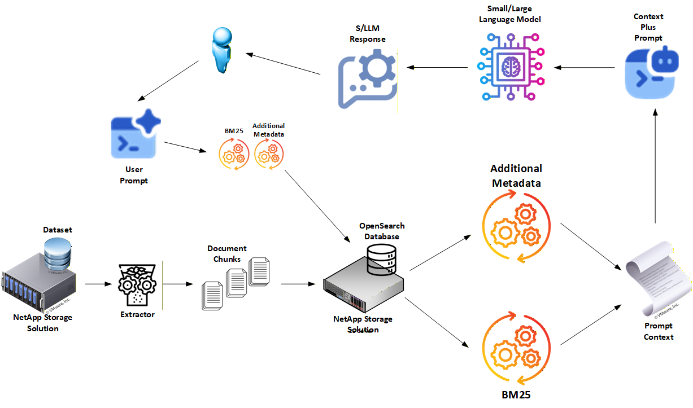

# Document-Based RAG: Better Option for AI Governance

Welcome to the **Document RAG Guide**: a dual-memory (LT + HOT) OpenSearch approach to Retrieval-Augmented Generation that delivers answers that are **transparent, deterministic, and governance-ready** by design. The repo houses two fully working paths:

* **Community / Open-Source Version**: a self-contained demo you can run on a laptop or in a pure open-source deployment.
* **Enterprise Version**: a production-grade variant that layers in ingest pipelines, NetApp FlexCache, SnapMirror, and other operational muscle.



By storing knowledge as **documents with enriched metadata** (named entities and provenance tags) instead of opaque vectors alone, the agent gains traceability, reduces hallucinations, and meets demanding audit requirements.

### Project Purpose

This project was developed to address limitations of traditional vector-centric RAG and to make retrieval **reproducible**, **explainable** and **auditable**.

* **Performance & latency**: The LT/HOT split exists primarily for **governance boundaries**, **retention variations control**, and **policy asymmetry**; retrieval remains lexical-first and observable.
* **Transparency and Explainability**: Vector embeddings are opaque. Document-based RAG stores explicit entity metadata (`explicit_terms`, `explicit_terms_text`) and uses fielded, auditable BM25 queries so you can show *why* a document matched.

Key objectives include:

* Provide a reference architecture for **Document-based RAG** with explicit **HOT (unstable)** and **Long-Term (LT)** tiers.
* Make promotion from **HOT → LT** a **controlled event** that happens only when (1) there is **enough positive reinforcement** of the data **or** (2) a **trusted human-in-the-loop** has verified it.
* Show upgrade paths-from a minimal Python demo to an enterprise pipeline with NetApp enterprise storage.

## Benefits Over Vector-Based RAG

While traditional vector-only RAG excels at semantic "vibes," it often struggles with the precision, auditability, and deterministic grounding required by the enterprise. Transitioning to a lexical-first (BM25 + Vector) architecture provides several critical advantages:

* **Deterministic Factual Grounding:** BM25 eliminates the "black box" of vector-only ranking by providing traceable, keyword-based evidence for every retrieval, ensuring exact matches for entities like product IDs or legal clauses.
* **Audit-Ready Provenance:** By utilizing explicit metadata fields (e.g., doc_version, ingested_at_ms), every fact used to ground an LLM response is tied to a verifiable source of truth, satisfying regulatory requirements for data lineage.
* **Mitigation of Semantic Drift:** Unlike vector embeddings, which can suffer from "hallucinated similarity" in high-dimensional space, lexical search anchors the retrieval in explicit term frequency, preventing contextually irrelevant documents from polluting the LLM prompt.
* **Storage-Aware Compliance:** Integrating with NetApp storage allows for immutable SnapCenter snapshots and MetroCluster replication, ensuring that the retrieved context is protected by enterprise-grade disaster recovery and point-in-time audit capabilities.
* **Operational Explainability:** Use of deterministic analyzers and keyword highlights makes it straightforward for human reviewers to understand exactly why the RAG agent selected a specific snippet, reducing the risk of hidden bias in embedding-only systems.


### Community vs Enterprise: What Changes?

| Capability                 | Community Edition                             | Enterprise Edition                                                          |
| -------------------------- | --------------------------------------------- | --------------------------------------------------------------------------- |
| **HOT backing store**      | `tmpfs` / RAM-disk on the dev box             | **NetApp FlexCache** for locality; (Optional) **SnapMirror** replicas       |
| **LT backing store**       | Rotating Disk, SSD, etc.                      | **NetApp FlexCache** for locality; Durability via **SnapMirror** replicas   |
| **Governance hooks**       | Basic provenance tags                         | Same as Community Version                                                   |
| **Latency posture**        | Latency is secondary to governance boundaries | Latency tuned per SLA, but the split is for **governance/policy asymmetry** |

> **TL;DR:** start with the community guide for laptops and commodity hardware; switch to the enterprise path when you need multi-site, 24×7, and **governance** at scale. The split exists for **control and auditability**, not because latency forces it.

## Where To Dive Deeper

| Document                                     | What it covers                                                                                        |
| -------------------------------------------- | ----------------------------------------------------------------------------------------------------- |
| **Document Search for Better AI Governance** | Vision & governance rationale for Document RAG [link](./Document_Search_for_Better_AI_Governance.md)  |
| **Community Version Guide**                  | Step-by-step setup for the open-source flavour [link](./OSS_Community_Version.md)                     |
| **Community README**                         | Hands-on commands & scripts [link](./community_version/README.md)                                     |
| **Enterprise Version Guide**                 | Deep dive on ingest pipelines, FlexCache, SnapMirror [link](./Enterprise_Version.md)                  |
| **Enterprise README**                        | Production deployment notes [link](./enterprise_version/README.md)                                    |

## Quick Start

```bash
# 1. Clone the repo
$ git clone https://github.com/NetApp/document-rag-guide.git

# 2. Pick your path
$ cd document-rag-guide/community_version   # laptop demo
# or
$ cd document-rag-guide/enterprise_version  # prod-ready deployment

# 3. Follow the README in that folder
```

Questions? Open an issue or start a discussion and contributions are welcome!
